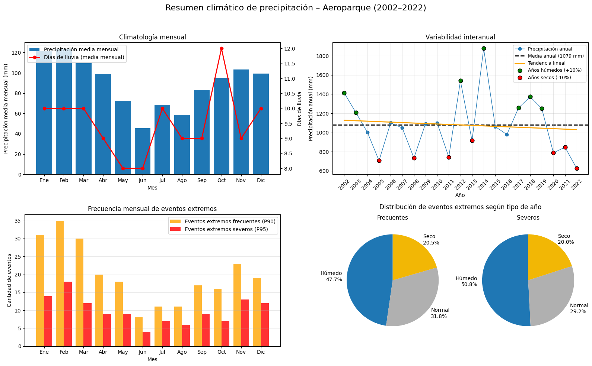

# Exploratory Climate Data Analysis with Python  
## Precipitation and Wind – Aeroparque Weather Station (2002–2022)

## 🌍 Project Overview

This project presents an exploratory data analysis (EDA) of daily climate data from the Aeroparque Weather Station (Buenos Aires, Argentina) for the period 2002–2022.

The main goal of the project is to demonstrate a complete **data analysis workflow in Python**, including data ingestion, cleaning, transformation, exploratory analysis, and synthesis of results using reproducible methods.

Climate data are used as a case study, combining time series analysis, statistical exploration, and environmental data interpretation.

**Author:** Joaquín Llarena  
**Year:** 2026  

---

> **Note:** This project's documentation and analysis are conducted in Spanish.  
> The README is provided in English for international accessibility.

---

## 🎯 Objectives

- Build a clean and consistent dataset from raw daily records provided by the Argentine National Meteorological Service (SMN).
- Explore seasonal and interannual variability of precipitation and wind.
- Identify and characterize extreme precipitation and wind events.
- Produce clear, reproducible metrics and visualizations suitable for a **Data Analysis portfolio**.

---

## 📊 Dataset

- **Source:** Argentine National Meteorological Service (SMN)
- **Station:** Aeroparque Weather Station
- **Location:** Buenos Aires (CABA), Argentina
- **Period:** 2002–2022
- **Temporal resolution:** Daily records

### Variables
- Daily precipitation
- Wind speed (scalar mean and daily maximum)
- Wind direction

### Data characteristics
The original data are provided in raw tabular text formats and are not directly suitable for analysis.  
Significant preprocessing was required, including parsing, cleaning, quality control, and integration into a consistent and analysis-ready dataset.

---

## 🛠️ Tools & Technologies

- **Python**
- **pandas** – data manipulation, cleaning, and aggregation
- **numpy** – numerical operations
- **matplotlib** – data visualization
- **Jupyter Notebook** – analysis, documentation, and reproducible workflows

---

## 🔍 Analysis Workflow

1. Data loading from raw SMN files.
2. Data cleaning and quality control.
3. Feature construction and aggregation (monthly and annual metrics).
4. Exploratory analysis of precipitation and wind regimes.
5. Identification and analysis of extreme events using percentile-based thresholds.
6. Visualization and synthesis of results.

---

## ♻️ Reproducibility 

The analysis was developed and executed using Google Colab.  
All notebooks are fully reproducible using the provided data and standard Python libraries for data analysis and visualization.

---

## 📈 Key Results & Outputs

### Analytical Scope

- Monthly and interannual analysis of precipitation.
- Identification of extreme precipitation events by month and by year type.
- Seasonal and directional characterization of wind behavior.
- Directional analysis of extreme wind events based on daily maximum wind speed.
- Comparative analysis of wind direction and extreme events between two sub-periods (first vs. last 10 years).

### Main Findings

- Precipitation and wind regimes show clear seasonal patterns, with higher intensity and variability during warmer months.
- Precipitation exhibits strong interannual variability, with alternating wet and dry years and a slight shift toward drier conditions in recent years.
- Extreme precipitation events are highly seasonal and are more frequent during wet years, although they can also occur under normal or dry annual conditions.
- Wind direction is dominated by easterly flows in terms of frequency, while the strongest wind events are primarily associated with southern sectors.
- Comparison between the first and last decades of the record suggests subtle changes in wind behavior, including a reduced contribution of extreme southern winds and a relative increase in intense events from other quadrants.

### Visual Summary

#### Precipitation


#### Wind


---

## ⚠️ Limitations

This study is limited to a single weather station and focuses on exploratory analysis rather than trend attribution or predictive modeling.

---

## 📂 Repository Structure

```text
/
├── notebook/
│   └── analisis_climatico_aeroparque.ipynb
├── data/
│   └── raw_data/
├── figures/
└── README.md
